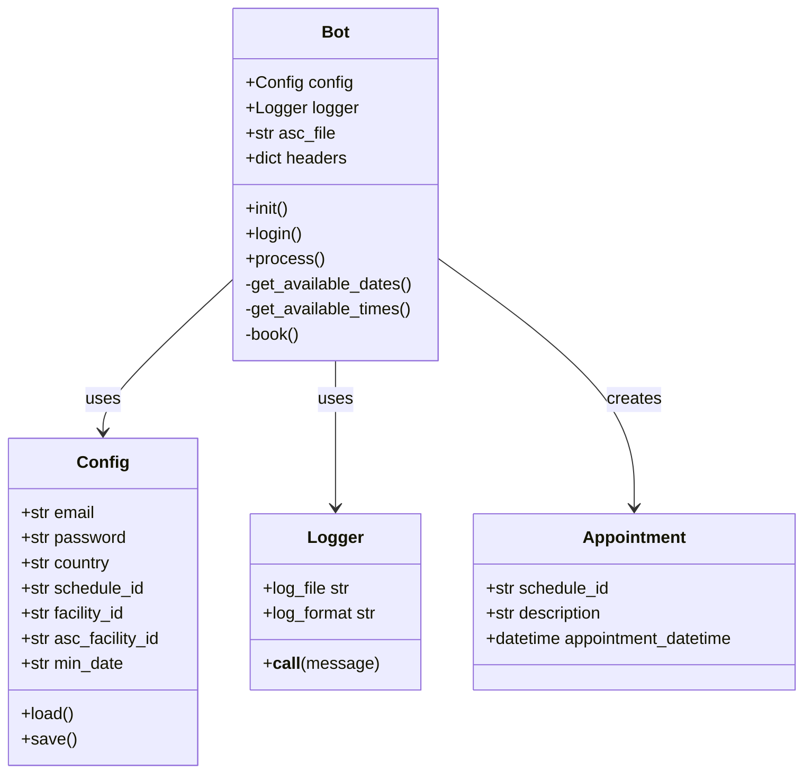
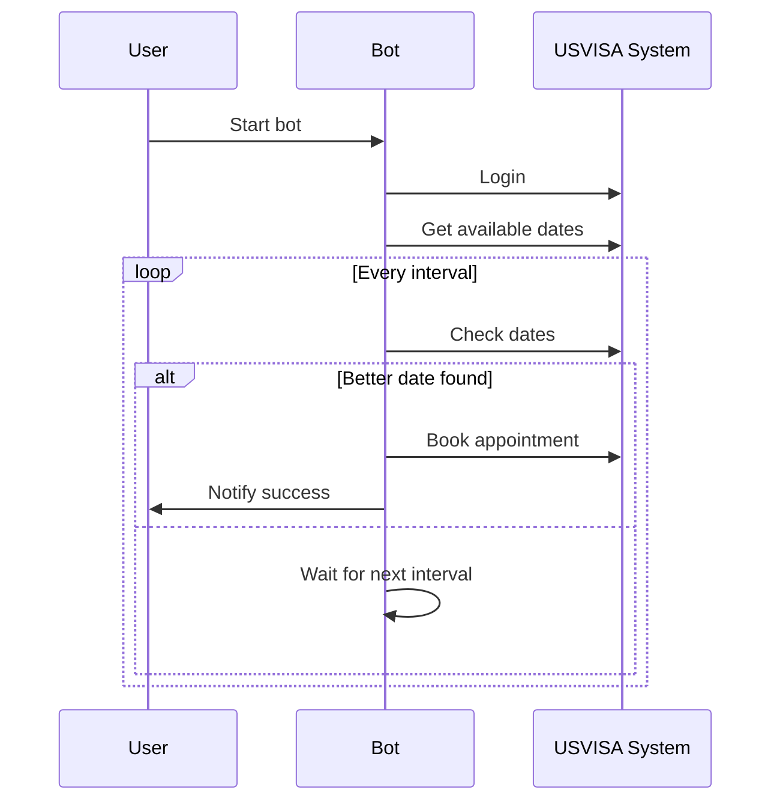
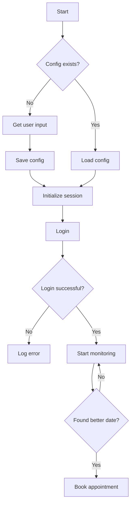
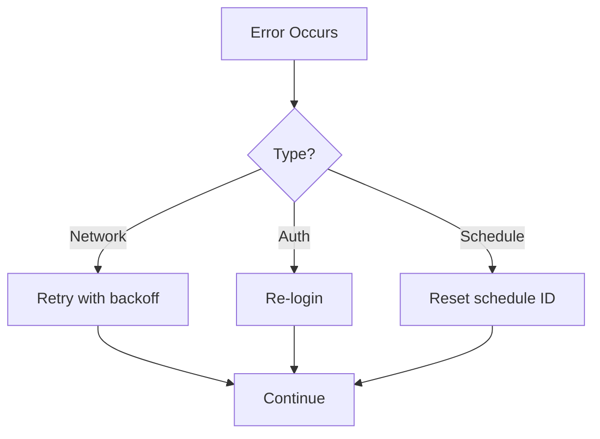

# USA VISA Bot Documentation

A Python bot for automating US visa appointment scheduling and rescheduling.

## Architecture

## Core Components

### 1. Configuration Management
- Handles user credentials and preferences
- Stores country selection, facility IDs, and scheduling parameters
- Persists data in a local config file

### 2. Appointment System

### 3. Session Management

## Key Features

1. **Automated Login**
   - Secure credential management
   - Session persistence
   - CSRF token handling

2. **Date Monitoring**
   - Continuous checking of available dates
   - Comparison with current appointment
   - Support for minimum date preferences

3. **Multi-facility Support**
   - Primary visa appointment facility
   - ASC (Application Support Center) scheduling
   - Facility ID management

4. **Error Handling**
   - Network error recovery
   - Session expiration handling
   - Comprehensive logging

## Configuration Options

| Parameter | Description | Required |
|-----------|-------------|----------|
| EMAIL | User's email address | Yes |
| PASSWORD | Account password | Yes |
| COUNTRY | Country code (e.g., 'mx' for Mexico) | Yes |
| SCHEDULE_ID | Current appointment ID | No |
| FACILITY_ID | Visa facility ID | No |
| ASC_FACILITY_ID | ASC facility ID | No |
| MIN_DATE | Minimum acceptable date | No |

## Supported Countries

The bot supports scheduling in multiple countries including:
- Mexico (mx)
- Canada (ca)
- United Kingdom (gb)
- India (in)
- And many more (see COUNTRIES dictionary in code)

## Error Handling

## Best Practices

1. **Rate Limiting**
   - Implements random delays between requests
   - Respects server limitations
   - Prevents account blocking

2. **Security**
   - No hardcoded credentials
   - Secure session management
   - HTTPS communication

3. **Maintainability**
   - Modular code structure
   - Comprehensive logging
   - Clear error messages
