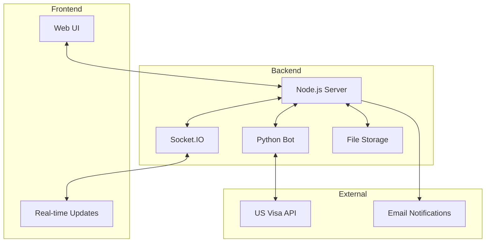
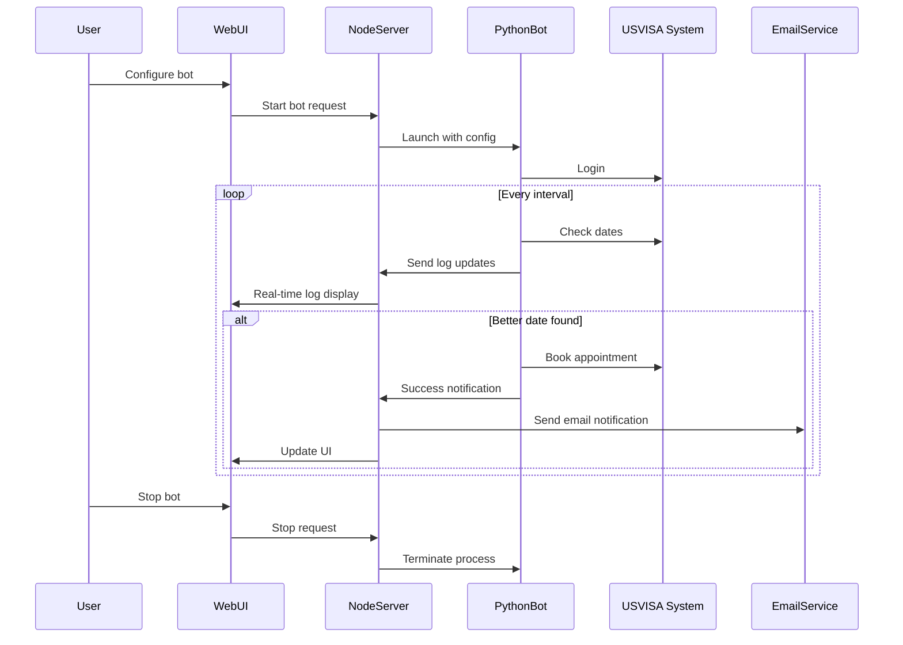
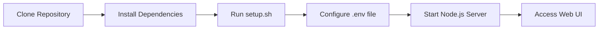
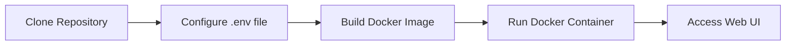
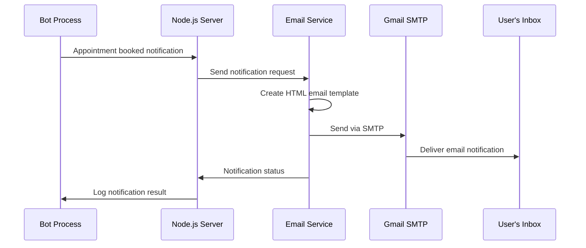
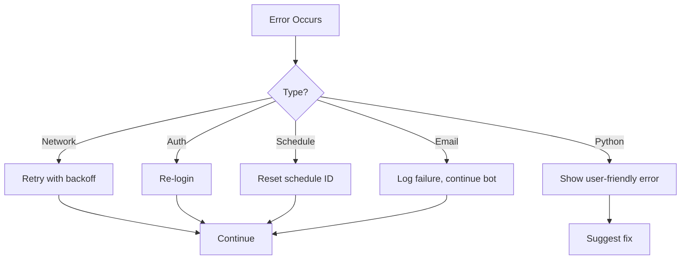

# USA VISA Bot Documentation

A Python bot for automating US visa appointment scheduling and rescheduling with a modern web interface.

## System Architecture

## Core Components

### 1. Web Interface
- Modern responsive UI built with Tailwind CSS
- Real-time log updates via Socket.IO
- Dashboard with bot statistics
- User-friendly form for bot configuration

### 2. Node.js Server
- Express.js web server
- Socket.IO for real-time communication
- PythonShell for Python process management
- File-based storage for bot configurations
- Email notification system via SMTP

### 3. Python Bot

## Key Features

1. **User-Friendly Interface**
   - Dashboard with real-time statistics
   - Intuitive bot configuration form
   - Responsive design for mobile and desktop
   - Clear visual indicators of bot status

2. **Enhanced Logging System**
   - Real-time log updates with emoji indicators
   - User-friendly message formatting
   - Log deduplication to reduce noise
   - Automatic log cleanup to manage memory usage
   - Direct display in UI without JSON storage

3. **Bot Management**
   - Multiple bot support
   - Start/stop/restart functionality
   - Persistent configuration storage
   - Manual and automatic startup options

4. **Containerization**
   - Docker support for easy deployment
   - Docker Compose for simplified orchestration
   - Volume mounting for data persistence
   - Cross-platform compatibility

5. **Appointment System**
   - Automated login and session management
   - Continuous monitoring of available dates
   - Intelligent date comparison
   - Support for multiple facilities

6. **Email Notifications**
   - Automatic email alerts when appointments are booked
   - Secure credential management via environment variables
   - Gmail SMTP integration with app password support
   - Detailed HTML email with appointment information
   - Configurable recipient address

## Configuration Options

| Parameter | Description | Required |
|-----------|-------------|----------|
| EMAIL | User's email address | Yes |
| PASSWORD | Account password | Yes |
| COUNTRY | Country code (e.g., 'ca' for Canada) | Yes |
| SCHEDULE_ID | Current appointment ID | No |
| FACILITY_ID | Visa facility ID | No |
| ASC_FACILITY_ID | ASC facility ID | No |
| MIN_DATE | Minimum acceptable date | No |

## Environment Variables

The application uses environment variables for sensitive configuration:

| Variable | Description | Required for Email |
|----------|-------------|-------------------|
| SENDER_EMAIL | Gmail address to send notifications from | Yes |
| SENDER_PASSWORD | Gmail app password (not regular password) | Yes |
| NOTIFICATION_EMAIL | Email address to receive notifications | Yes |

## Supported Countries

The bot supports scheduling in multiple countries including:
- Canada (ca)
- Mexico (mx)
- United Kingdom (gb)
- India (in)
- And many more (see COUNTRIES dictionary in code)

## Deployment Options

### 1. Local Development

### 2. Docker Deployment

## Email Notification System

## Error Handling

## Best Practices

1. **Rate Limiting**
   - Implements random delays between requests
   - Respects server limitations
   - Prevents account blocking

2. **Security**
   - No hardcoded credentials
   - Environment variables for sensitive data
   - Secure session management
   - HTTPS communication

3. **User Experience**
   - Meaningful log messages
   - Emoji indicators for visual scanning
   - Automatic cleanup of repetitive logs
   - Clear error messages with suggested fixes
   - Email notifications for important events

4. **Resource Management**
   - Efficient memory usage
   - Automatic log rotation
   - Proper process termination
   - Docker resource constraints
